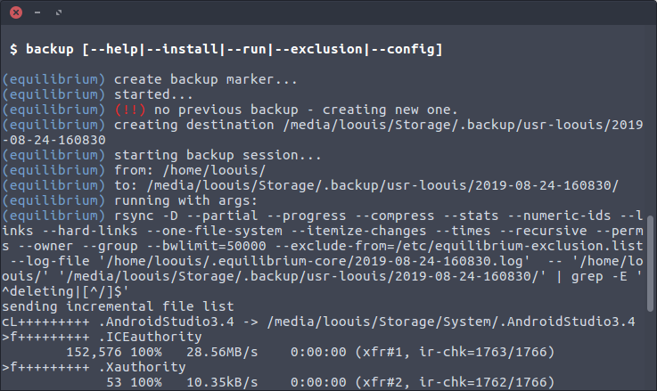

# equilibrium 1.0.32

<p align="left">
  
  
  
  
  
  
  
  
  
  
  
  
</p>

> A lightweight low-level time machine backup utility for Linux

I wrote this because at my workplace has a terrible IT culture. That backing data is an optional practice. **Equilibrium** helps me to  incrementally backup changes on my working computer, I need something very straight forward and lightweight but not sacrifying the backup performance or even hogging the host system. And I also can even configure with `crontab`.

<p align="left">
  
  
  
  
</p>

### _files

- `equilibrium` is a main script.
- `equilibrium-core` is a core script.
- `equilibrium.conf` is where settings are located.
- `equilibrium-exclusion.list` is where you can add exclusion files and directories.

### _volume structure

```bash
.
├── 2019-08-17-144927       (e.g. volume 1)
├── 2019-08-17-154805       (e.g. volume 2)
├── 2019-08-17-155055       (e.g. volume 3)
├── backup.inprogress       (resume indicator)
├── backup.marker           (resume marker data)
└── latest                  (endpoint to latest backup)
```

### _features

- each backup volume is determined by date per backup session.
- continuously resume backup with a marker system.
- auto generates path to the latest backup volume.
- auto exclude residual files and directories.
- generate statistics after finished backup session.


### _get

```bash
$ git clone https://github.com/loouislow81/equilibrium.git
$ cd equilibrium
```

### _install

```bash
$ sudo ./equilibrium --install
```

or if you prefer binary version, go [download binary](https://github.com/loouislow81/equilibrium/releases).

### _configure

after installed you can use without the `./` and it is ready to run system-wide,

```bash
$ sudo equilibrium --config
```

edit file `/etc/equilibrium.conf` to change whatever necessary to suit your backup behaviour,

*(!!)* value for `bandwidth_limit` is in `kBytes`, value `50000` is `50 MBytes/s` transfer rate by default.

```bash
##### configurations for `backup` script

USER="loouis"
BACKUP_SOURCE="/home/${USER}"
BACKUP_MEDIUM="/media/${USER}/EX-VOLUME-A"
BACKUP_DESTINATION="${BACKUP_MEDIUM}/.backup/usr-${USER}"

##### configuration for `equilibrium-core` script

bandwidth_limit=50000
exclusion_list='/etc/equilibrium-exclusion.list'
```

### _exclusion

to add file or directories into backup session,

```bash
$ sudo equilibrium --exclusion
```

### _run

simply,

```bash
$ sudo equilibrium --run
```

or add one of them to `cronjob`,

```bash
@monthly sudo /usr/local/bin/equilibrium --run
```

or

```bash
@weekly sudo /usr/local/bin/equilibrium --run
```

Enjoy!

---

[MIT](https://github.com/loouislow81/equilibrium/blob/master/LICENSE)
