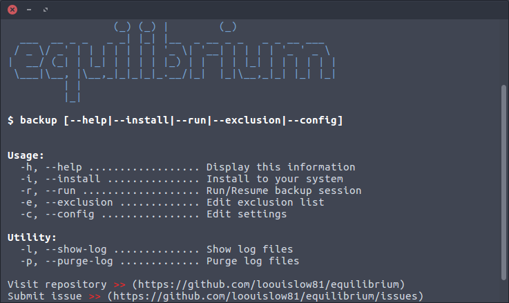

# equilibrium 1.0.23

> A lightweight low-level time machine backup utility for Linux

I wrote this because at my workplace has a terrible IT culture. That backing data is an optional practice. **Equilibrium** helps me to  incrementally backup changes on my working computer, I need something very straight forward and lightweight but not sacrifying the backup performance or even hogging the host system. And I also can even configure with `crontab`.

<p align="left">
  
  
  
  
</p>

### _files

- `backup` is an main script.
- `equilibrium-core` is a core script.
- `equilibrium.conf` is where settings are located.
- `equilibrium-exclusion.list` is where you can add exclusion files and directories.

### _volume structure

```bash
.
├── 2019-08-17-144927       (e.g. volume 1)
├── 2019-08-17-154805       (e.g. volume 2)
├── 2019-08-17-155055       (e.g. volume 3)
├── backup.inprogress       (resume indicator)
├── backup.marker           (resume marker data)
└── latest                  (endpoint to latest backup)
```

### _features

- each backup volume is determined by date per backup session.
- continuously resume backup with a marker system.
- auto generates path to the latest backup volume.
- auto exclude residual files and directories.
- generate statistics after finished backup session.


### _get

```bash
$ git clone https://github.com/loouislow81/equilibrium.git
$ cd equilibrium
```

### _install

```bash
$ sudo ./backup --install
```

or if you prefer binary version, go [download binary](https://github.com/loouislow81/equilibrium/releases/download/v1.0.23/equilibrium_1.0.23_x86-64_linux.tar.gz).

### _configure

after installed you can use without the `./` and it is ready to run system-wide,

```bash
$ sudo backup --config
```

edit file `/etc/equilibrium.conf` to change whatever necessary to suit your backup behaviour,

*(!!)* value for `bandwidth_limit` is in `kBytes`, value `50000` is `50 MBytes/s` transfer rate by default.

```bash
##### configurations for `backup` script

USER="loouis"
BACKUP_SOURCE="/home/${USER}"
BACKUP_MEDIUM="/media/${USER}/EX-VOLUME-A"
BACKUP_DESTINATION="${BACKUP_MEDIUM}/.backup/usr-${USER}"

##### configuration for `equilibrium-core` script

bandwidth_limit=50000
exclusion_list='/etc/equilibrium-exclusion.list'
```

### _exclusion

to add file or directories into backup session,

```bash
$ sudo backup --exclusion
```

### _run

simply,

```bash
$ sudo backup --run
```

or add one of them to `cronjob`,

```bash
@monthly sudo /usr/local/bin/backup --run
```

or

```bash
@weekly sudo /usr/local/bin/backup --run
```

Enjoy!

---

MIT License

Copyright (c) 2018 Loouis Low

Permission is hereby granted, free of charge, to any person obtaining a copy
of this software and associated documentation files (the "Software"), to deal
in the Software without restriction, including without limitation the rights
to use, copy, modify, merge, publish, distribute, sublicense, and/or sell
copies of the Software, and to permit persons to whom the Software is
furnished to do so, subject to the following conditions:

The above copyright notice and this permission notice shall be included in all
copies or substantial portions of the Software.

THE SOFTWARE IS PROVIDED "AS IS", WITHOUT WARRANTY OF ANY KIND, EXPRESS OR
IMPLIED, INCLUDING BUT NOT LIMITED TO THE WARRANTIES OF MERCHANTABILITY,
FITNESS FOR A PARTICULAR PURPOSE AND NONINFRINGEMENT. IN NO EVENT SHALL THE
AUTHORS OR COPYRIGHT HOLDERS BE LIABLE FOR ANY CLAIM, DAMAGES OR OTHER
LIABILITY, WHETHER IN AN ACTION OF CONTRACT, TORT OR OTHERWISE, ARISING FROM,
OUT OF OR IN CONNECTION WITH THE SOFTWARE OR THE USE OR OTHER DEALINGS IN THE
SOFTWARE.
